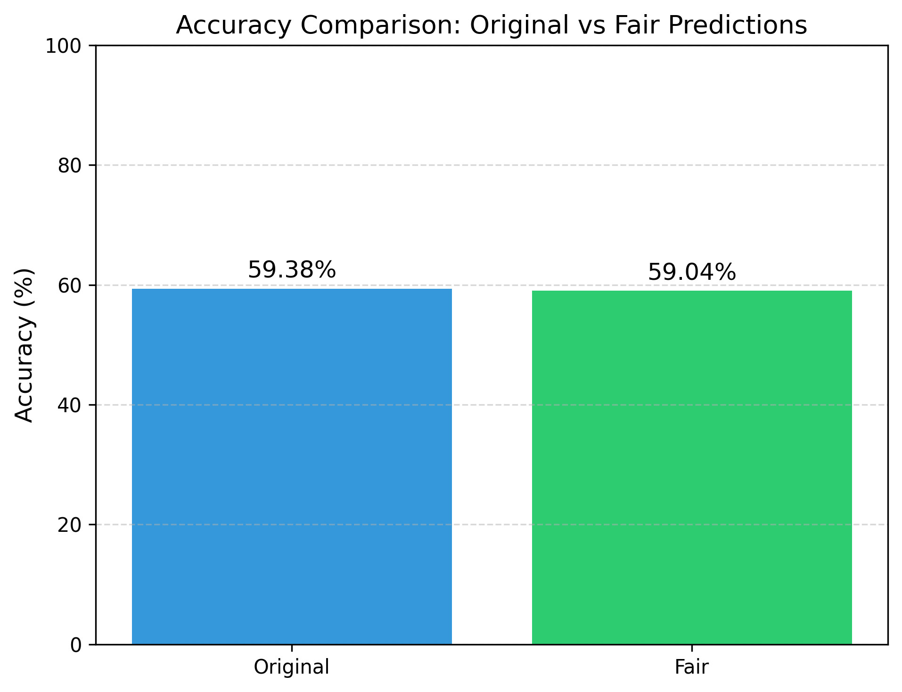
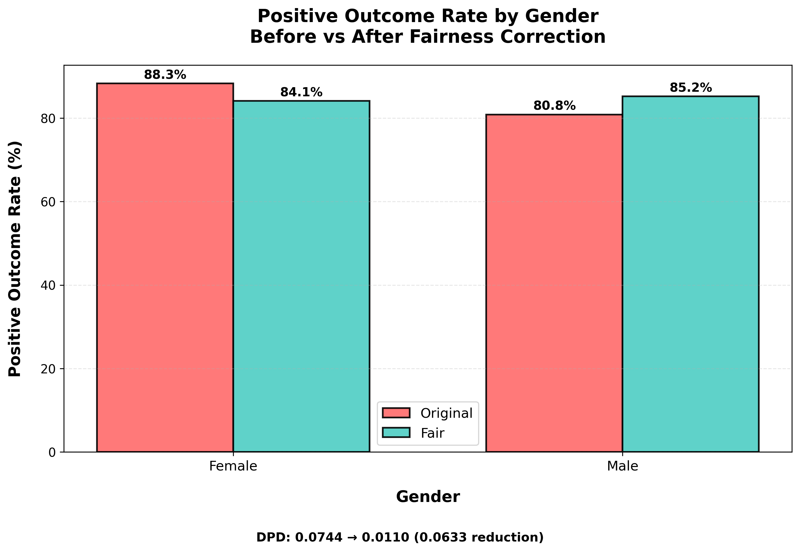
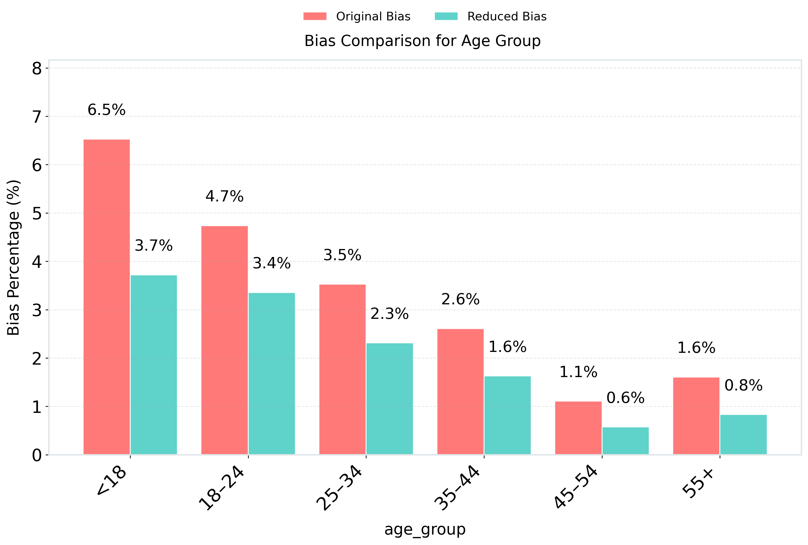
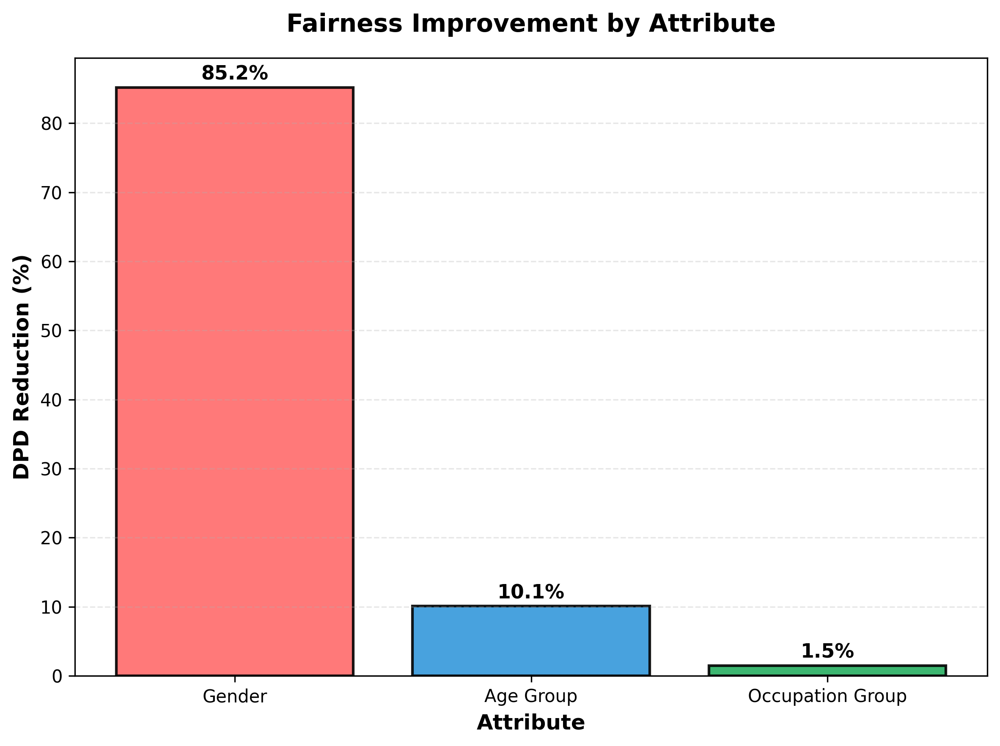

# Fairness-Aware Counterfactual Correction for Movie Recommendations

[](https://www.python.org/)
[](LICENSE)

An end-to-end machine learning pipeline implementing counterfactual fairness on the MovieLens 1M dataset. This project demonstrates how to detect, quantify, and mitigate demographic bias (Gender, Age, and Occupation) in a logistic regression recommendation model while preserving overall prediction accuracy. 

This work is designed for reproducibility and showcases comprehensive fairness metrics, including Demographic Parity Difference (DPD), Positive Outcome Rates (POR), and bias reduction percentages across individual and group levels.

---

## Key Results (Generated by this code)

| Metric | Original | After Fairness | Improvement |
| :--- | :--- | :--- | :--- |
| Model Accuracy | 59.38% | 59.04% | Minimal Loss (0.34%) |
| Individual Bias | 4.32% | 2.33% | 46.1% Reduction |
| Gender DPD | 0.0744 | 0.0110 | 85.2% Reduction |
| Age Group DPD | 0.2058 | 0.1850 | 10.1% Reduction |

---

## Repository Structure

```text
.
├── README.md                   # Project documentation (this file)
├── ratings.dat                 # MovieLens 1M ratings data
├── users.dat                   # MovieLens 1M users data
├── movies.dat                  # MovieLens 1M movies data
│
├── Code Pipeline (Run in order):
│   ├── Individua_Bias.py       # Step 1: Trains model & generates counterfactual_analysis.csv
│   ├── GroupBias.py            # Step 2: Generates group-level bias summaries (Gender/Age/Occupation)
│   ├── Individual_Bias_Reduction.py # Step 3: Calculates & visualizes individual-level bias reduction
│   ├── Group_Bias_Reduction.py # Step 4: Applies bias reduction & visualizes group comparisons
│   ├── Accuracy_1M.py          # Step 5: Compares original vs. fair accuracy
│   ├── POR_DPD.py              # Step 6: Computes detailed POR & DPD for all groups
│   ├── POR_DPD_Visualization.py # Step 7: Generates publication-quality PNG charts
│   └── VisualizationBias.py    # Step 8: Optional additional group-level bias charts
│
├── Outputs (Generated automatically):
│   ├── counterfactual_analysis.csv
│   ├── gender_bias_summary.csv
│   ├── age_bias_summary.csv
│   ├── occupation_bias_summary.csv
│   ├── fairness_metrics_summary_all.csv
│   └── *.png files (All bar charts and comparison plots)

How to Run (Reproduction Pipeline)
Because the scripts are interdependent, you must run them in the exact order listed below.
```text
### 1. Prerequisites
Make sure you have the required Python libraries installed:
```bash
pip install pandas numpy matplotlib scikit-learn
```text
### 2. Execute the Analysis Pipeline
Run the following commands sequentially in your terminal from the project's root directory:
```bash
# Step 1: Train model and run counterfactual analysis (generates counterfactual_analysis.csv)
python Individua_Bias.py

# Step 2: Calculate group-level bias summaries (generates *_bias_summary.csv files)
python GroupBias.py

# Step 3: Calculate and visualize individual-level bias reduction
python Individual_Bias_Reduction.py

# Step 4: Apply group-level bias reduction and generate comparison charts
python Group_Bias_Reduction.py     

# Step 5: Calculate and compare original vs. fair prediction accuracy
python Accuracy_1M.py

# Step 6: Calculate detailed Positive Outcome Rates (POR) and Demographic Parity Difference (DPD)
python POR_DPD.py

# Step 7: Generate all final visualization PNG files
python POR_DPD_Visualization.py
## Outputs Explained
counterfactual_analysis.csv: The core dataset containing 10,000 test samples, original predictions, gender-flipped predictions, and ground truths.

Accuracy_1M.py Output: Shows that the fairness correction preserves nearly all model accuracy.

POR_DPD.py Output: Prints detailed console logs showing the exact Positive Outcome Rate for every gender, age group, and occupation—before and after the fairness correction.

## Generated PNGs (The 5 selected charts):
  - `accuracy_comparison.png`
  - `individual_bias_reduction.png`
  - `Gender_POR_Comparison.png`
  - `age_group_bias_comparison.png`
  - `Fairness_Improvement_Summary.png`





*(Note: `VisualizationBias.py` also generates `individual_bias_bar.png`, `group_gender_bias_bar.png`, `group_age_bias_bar.png`, and `group_occupation_bias_bar.png` as backup visualizations).*

## License
Distributed under the MIT License. See LICENSE for more information.

## 📬 Contact
For any questions regarding this implementation, please open an issue in this repository.

## 📚 Dataset
This project uses the **MovieLens 1M Dataset**. 
The dataset contains 1,000,209 anonymous ratings of approximately 3,900 movies made by 6,040 MovieLens users.

Please cite the following paper if you use this data in your own research:
> F. Maxwell Harper and Joseph A. Konstan. 2015. The MovieLens Datasets: History and Context. ACM Transactions on Interactive Intelligent Systems (TiiS) 5, 4, Article 19 (December 2015). DOI: http://dx.doi.org/10.1145/2827872
